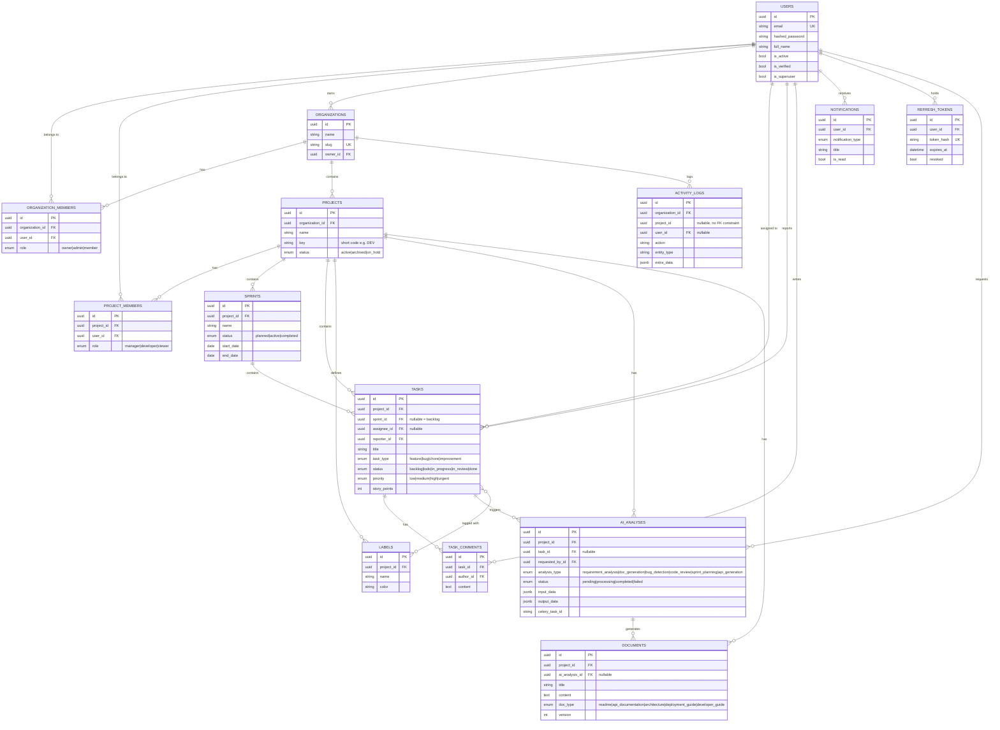

# DevFlow AI — Database Schema

Multi-tenant schema: `organizations` is the top-level tenant boundary.
Every `project` belongs to one organization; every task, sprint,
label, AI analysis, and document belongs to one project.

## Entity-Relationship Diagram

## Design decisions

- **UUID primary keys** everywhere — avoids sequential-ID enumeration
  attacks and merges cleanly across environments (dev/staging/prod
  seed data won't collide).
- **Multi-tenancy via `organizations`** — every project is scoped to
  an organization; a user's role differs per-organization
  (`organization_members`) and per-project (`project_members`), since
  someone might be an Admin at the org level but only a Developer on
  a specific project.
- **Soft coupling for `activity_logs.project_id`** — intentionally not
  a foreign key, since activity logs should survive project deletion
  for audit purposes (append-only compliance record).
- **`refresh_tokens` stores only a hash**, never the raw token — a
  database leak alone can't be used to forge a session.
- **JSONB for AI analysis input/output** — each of the 6 AI analysis
  types has a different result shape (a code review result looks
  nothing like a sprint plan), so a flexible JSONB column avoids
  either a sparse table or six near-duplicate tables.
